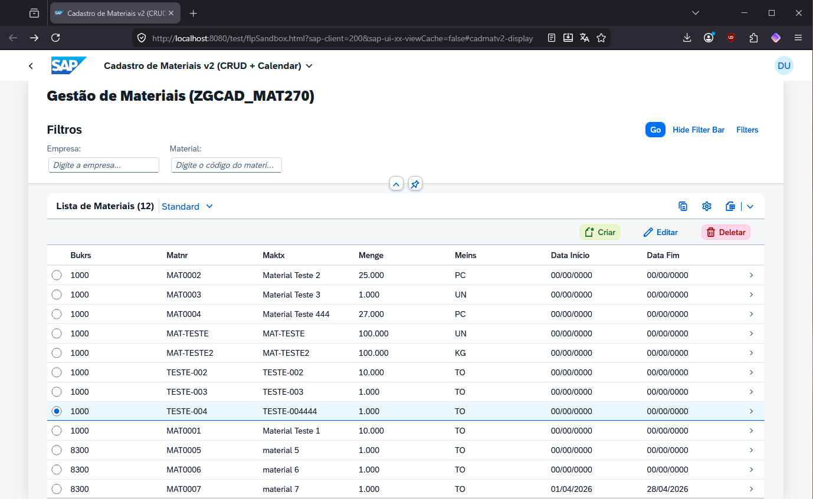

## Application Details
|               |
| ------------- |
|**Generation Date and Time**<br>Sat Apr 04 2026|
|**App Name**<br>cadmatv2|
|**Type**<br>SAP System (ABAP On Premise)|
|**URL**<br>https://cromos.opus-idc.com.br:44300/sap/opu/odata/sap/ZGCAD_MAT270_SRV
|**Title**<br>Cadastro de Materiais v2 (CRUD + Calendar)|
|**Worklist**<br>Worklist view with Smart Table|
|**Object Page**<br>Object Page view|
|**Create Page**<br>Create Page view|
|**Update Page**<br>Update Page view|
|**Calendar Page**<br>Calendar Page view to show promotion start/end date|

## cadmatv2

Cadastro de Materiais v2 (CRUD + Calendar)

## Step-by-step
|               |
| ------------- |
|**Worklist+SmartTable**<br>Criar Worklist c/ SmartTable <br>+ Filter Bukrs+Matnr <br>+ Navegaçao para ObjectPage.view.xml|
|**Object Page**<br>Criar Object page Object.view.xml|
|**Create Page**<br>Criar Create page Create.view.xml|
|**Update Page**<br>Criar Update page Update.view.xml|
|**Calendar Page**<br>Criar Calendar page Calendar.view.xml|

### Starting the generated app

```
    npm start
```

### Estudos:
|               |
| ------------- |
|**Exemplos**<br>https://ui5.sap.com/#/entity/sap.ui.comp.smarttable.SmartTable|
|**Exemplos SmartTable+Filter**<br>https://ui5.sap.com/#/entity/sap.ui.comp.smarttable.SmartTable/sample/sap.ui.comp.sample.smarttable.mtableCustomToolbar|
|**Exemplos YOUTUBE**<br>https://www.youtube.com/watch?v=7GN4SimtV18|

### PROMPTS
|               |
| ------------- |
|no sap fiori, quando crio o serviço de gateway de nome "ZGCAD_MAT270", para ler a tabela transparente ZCAD_MAT270 contendo os campos BUKRS, MATNR, MAKTX, MENGE, MEINS, na minha classe ZCL_ZGCAD_MAT270_DPC_EXT. Os campos chave são BUKRS e MATNR. Tenho um "Worklist.view.xml" vazio por enquanto. Como adicionar um smartTable com filtro nos campos "Bukrs" e "Matnr"?|

### SAPUI5 sap component page
https://ui5.sap.com/#/entity/sap.m.PlanningCalendar/sample/sap.m.sample.PlanningCalendar/code

### App Screenshots



